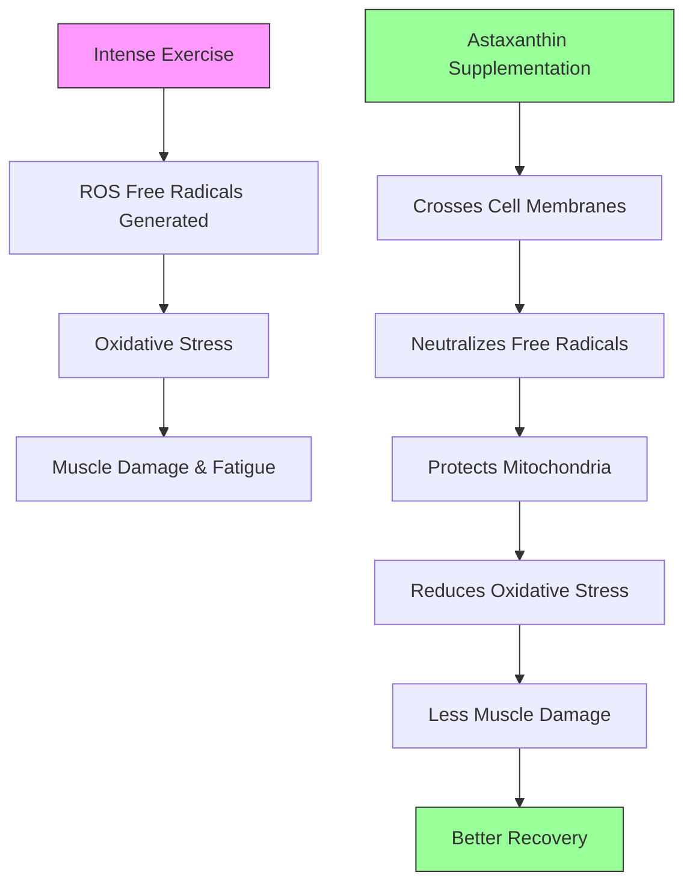

# Astaxanthin Supplementation for Athletes: The Science Behind the Pink Powerhouse

If you've ever wondered why salmon flesh is that distinctive pinkish-orange color, the answer is astaxanthin—a powerful carotenoid pigment that not only gives wild salmon their vibrant hue but also happens to be one of the most potent antioxidants ever studied. For athletes pushing their bodies through intense training, this compound is generating serious buzz in the supplement world. But what's the actual science behind it, and should you be adding it to your protocol?

## What is Astaxanthin?

Astaxanthin is a carotenoid pigment naturally found in marine organisms like salmon, shrimp, krill, and algae. It's what gives wild-caught salmon their characteristic pink flesh and why flamingos are pink (they consume astaxanthin-containing shrimp). But beyond its role as a natural colorant, astaxanthin functions as a remarkably powerful antioxidant in the human body.

When it comes to antioxidant potency, astaxanthin stands in a league of its own. Research consistently shows it's significantly stronger than vitamin C, vitamin E, beta-carotene, and even resveratrol. Some studies suggest it's up to 6,000 times more powerful than vitamin C in certain antioxidant assays. This isn't just marketing hype—it's backed by peer-reviewed research.

What makes astaxanthin particularly interesting for athletes is its unique ability to bioaccumulate in muscle tissue. Unlike many water-soluble antioxidants that pass through the body relatively quickly, astaxanthin is fat-soluble and gets incorporated into cell membranes throughout the body, including skeletal muscle. This means it can provide sustained antioxidant protection exactly where athletes need it most—inside the muscles working hard during training.

## The Antioxidant Mechanism

To understand why astaxanthin matters for athletes, you need to understand oxidative stress. When you train intensely, your muscles generate free radicals as a byproduct of energy production. These reactive oxygen species (ROS) are normal byproducts, but when production overwhelms your body's natural antioxidant defenses, you get oxidative stress. This contributes to muscle damage, fatigue, and can impair recovery between sessions.

Astaxanthin tackles this problem at the cellular level through several mechanisms. First, it directly neutralizes free radicals, donating electrons to stabilize these reactive molecules before they can damage cellular structures. Second, it protects mitochondrial membranes—the powerhouses of your cells—helping maintain energy production efficiency during and after exercise.

Here's what makes astaxanthin special compared to other antioxidants: it doesn't become a pro-oxidant. Some antioxidants, particularly when taken in isolation or at high doses, can actually paradoxically increase oxidative stress. Astaxanthin appears to avoid this issue, maintaining its protective properties without generating new problems.

The molecular structure of astaxanthin allows it to span entire cell membranes, providing what researchers call "membrane protection." This is unlike many antioxidants that work in specific cellular compartments. Think of it as antioxidant armor for your entire cell membrane rather than a single-point defense system.

## Research on Performance and Recovery

The research on astaxanthin and athletic performance has grown substantially over the past two decades, though it's important to note the field still has room for more large-scale studies.

**Exercise-Induced Oxidative Stress:** Multiple studies demonstrate that astaxanthin supplementation reduces markers of exercise-induced oxidative stress. Research on both untrained individuals and trained athletes shows decreases in lipid peroxidation markers and DNA damage indicators after intense exercise in groups taking astaxanthin compared to placebo.

**DOMS Reduction:** Delayed onset muscle soreness is a familiar enemy for anyone pushing new training boundaries. Several studies suggest astaxanthin can help here. A notable study published in the Journal of the International Society of Sports Nutrition found that participants taking 4mg of astaxanthin daily for three weeks experienced significantly less muscle soreness following eccentric exercise compared to placebo. The proposed mechanism: reduced oxidative damage to muscle fibers translates to less inflammation and less soreness.

**Endurance Performance:** The endurance picture is more nuanced but promising. Some studies show improved time-to-exhaustion in cyclists and runners supplementing with astaxanthin, while others show minimal direct performance effects but clearer recovery benefits. A study on competitive cyclists found that 4mg daily for four weeks improved anaerobic threshold and reduced feelings of exertion during exhaustive exercise. The theory is that better-protected mitochondria can sustain higher intensity efforts before fatigue sets in.

**Strength Training:** Research specific to strength training is more limited but suggests similar recovery benefits. The reduction in oxidative stress and potential decrease in muscle damage could translate to better recovery between sessions, potentially allowing for higher training volume over time. However, direct strength or hypertrophy-specific studies are still needed.

## Practical Considerations for Athletes

If you're considering adding astaxanthin to your supplement stack, here's what the research suggests for practical implementation:

**Dosing:** Most research uses 4-12mg daily. Studies showing benefits typically use at least 4mg, with 8mg being common in more recent trials. Higher doses haven't necessarily shown proportionally better results, so starting with 4-8mg seems reasonable.

**Timing:** Astaxanthin is fat-soluble, meaning it absorbs better when taken with a meal containing fats. Taking it with your largest meal of the day—breakfast or post-workout—optimizes absorption. Consistency matters more than timing; taking it at the same time each day helps maintain stable blood levels.

**Time to Effect:** Don't expect immediate results. Most studies showing performance and recovery benefits run for 2-4 weeks before measuring outcomes. This makes sense given that astaxanthin needs to saturate muscle tissue to provide meaningful protection. Think of it as building up your antioxidant reserves rather than an acute performance booster.

**Comparison to Other Antioxidants:** Should you replace your vitamin C or E with astaxanthin? Not necessarily. Different antioxidants work through different mechanisms and in different cellular compartments. Some researchers suggest a combination approach—though it's worth noting that mega-dosing multiple antioxidants hasn't shown additional benefits and may even be counterproductive. If you're going to add astaxanthin, it can complement an otherwise solid baseline of whole food antioxidants from fruits and vegetables.

**Quality Matters:** Astaxanthin supplements vary significantly in quality. Look for products specifying "astaxanthin" as the active ingredient (not just "algae extract" or similar terms). Natural astaxanthin (from Haematococcus pluvialis algae) is generally considered superior to synthetic versions. Third-party tested brands provide more confidence in label accuracy.

## Bottom Line

Astaxanthin isn't a magic pill that will transform your performance overnight. What the research supports is a legitimate role as a recovery tool, particularly for athletes training at high volumes or dealing with significant exercise-induced oxidative stress.

**Who might benefit most:**

- Athletes with high weekly training volumes
- Older athletes (whose natural antioxidant defenses may be less robust)
- DOMS after intense sessions
- Those already covering the fundamentals: adequate sleep, nutrition, and training programming

**Realistic expectations:**

- Expect 2-4 weeks of consistent use before noticing recovery benefits
- Don't expect immediate performance gains—this isn't a pre-workout
- The primary value is in supporting recovery between hard sessions, not in acute performance

**Cost vs. Benefit:**

Astaxanthin isn't cheap—quality supplements run $20-40 for a month's supply. Whether that's worthwhile depends on your training context. If you're a recreational lifter with moderate training volume, you might not notice much difference. If you're an advanced athlete pushing high volumes, the recovery support could be valuable.

The bottom line: astaxanthin has solid science behind it for recovery applications and represents one of the more promising sports supplement options to emerge in recent years. It's not essential, but it's also not hype. For athletes looking to optimize every aspect of recovery, it's worth considering as part of a comprehensive supplement strategy built on the fundamentals first.

---

*Track your recovery and progressive overload with Jacked. Download now.*
