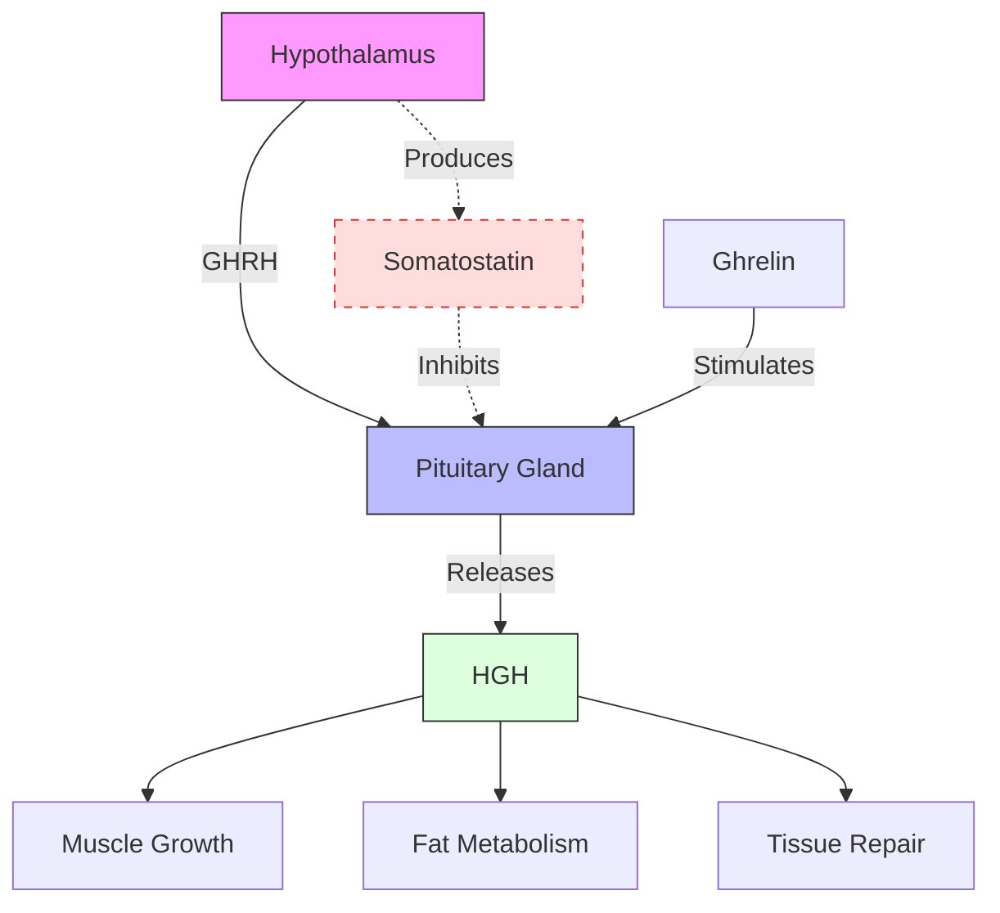

# Natural HGH Boosters: What Actually Works for Lifters

The supplement industry loves to push products promising to boost your human growth hormone (HGH). Walk through any gym supplement store and you'll find bottles claiming to increase HGH, accelerate muscle growth, and speed recovery. But here's the uncomfortable truth: most of these products don't work. At best, they're wasted money. At worst, they're taking advantage of people who just want to get bigger and stronger.

So what does the science actually say? Which HGH boosters have legitimate evidence behind them, and which are just marketing hype? Let's dig into the research.

## What is HGH and Why Should Lifters Care?

Human growth hormone is a peptide hormone produced by the pituitary gland. It plays a crucial role in muscle growth, fat metabolism, bone density, and overall tissue repair. For bodybuilders and strength athletes, HGH is attractive because it stimulates protein synthesis, promotes fat burning, and enhances recovery between training sessions.

The catch: HGH secretion follows a pulsatile pattern, with the largest pulses occurring during deep sleep—specifically during slow-wave sleep (stages 3 and 4). During waking hours, HGH levels are relatively low. This is why sleep quality is arguably the most important factor for natural HGH optimization, but more on that later.

HGH levels also decline with age. Peak production happens during adolescence and early adulthood, then gradually decreases. By age 30, many people produce significantly less HGH than they did in their teens. This decline drives interest in HGH-boosting supplements, but it also explains why the anti-aging industry has embraced HGH marketing.

## The Science of HGH Stimulation

Understanding how HGH is actually released helps explain why most supplements fail.

The hypothalamic-pituitary axis controls HGH secretion. The hypothalamus releases growth hormone-releasing hormone (GHRH), which signals the pituitary to release HGH. Simultaneously, somatostatin inhibits HGH release. Ghrelin, the "hunger hormone," also stimulates HGH.

This regulatory system is precisely controlled. The body doesn't just dump HGH into your bloodstream whenever you take a supplement—it's gated by multiple neurological and hormonal signals.

This is why the delivery method matters so much. Something that works intravenously (like high-dose amino acid infusions used in research) may have zero effect when taken orally, because your digestive system breaks it down before it reaches your bloodstream in meaningful amounts.

## Amino Acids: Arginine, Lysine, and Ornithine

These three amino acids are the most commonly marketed HGH boosters. The theory: they're precursors to nitric oxide and can stimulate GHRH release, thereby increasing HGH.

The research tells a complicated story.

Intravenous infusion of arginine has shown impressive results—studies using IV delivery report 8-20x increases in HGH levels. This sparked interest in oral supplementation. However, oral delivery tells a different tale.

A 2006 study in the Journal of Applied Physiology found that oral arginine actually attenuated the growth hormone response to resistance exercise. In other words, taking arginine before training may have blunted your body's natural HGH spike from the workout itself.

Another study gave weightlifters combined l-arginine, l-ornithine, and l-lysine supplementation (2g per day for 4 days) and found no change in 24-hour GH levels compared to placebo.

The problem: oral amino acids hit your bloodstream in amounts far smaller than what triggers HGH release through intravenous administration. At doses high enough to potentially work (15-30g), you'd experience severe gastrointestinal distress—essentially, you'd vomit before you'd boost your HGH.

**Verdict: Generally ineffective as oral supplements for lifters.** Save your money.

## Gamma-Aminobutyric Acid (GABA)

GABA is an inhibitory neurotransmitter that reduces neuronal excitability. But it also plays a role in HGH regulation—specifically, GABA can stimulate HGH release through hypothalamic pathways.

This is where the research gets interesting.

A 2008 study in the Journal of Clinical Endocrinology and Metabolism had eleven resistance-trained men take either 3g GABA or placebo, then perform resistance exercise. The GABA group showed significantly higher GH levels both at rest and post-exercise compared to placebo.

Another study combined GABA supplementation with whey protein and found improvements in whole-body fat-free mass in men after resistance training—suggesting the GH increase translated to meaningful muscle-building outcomes.

The typical effective dose appears to be 1-3 grams, taken either before bed (to coincide with natural HGH pulses) or before training (to augment exercise-induced GH release).

**Verdict: The most promising over-the-counter HGH booster with decent research behind it.** Worth trying if you're interested in this category.

## Mucuna Pruriens (Velvet Bean)

Mucuna pruriens is a tropical legume that contains L-DOPA, the direct precursor to dopamine. Since dopamine can inhibit somatostatin (the hormone that suppresses HGH), mucuna may indirectly support HGH release by removing one of the brakes on growth hormone secretion.

Research on mucuna and HGH specifically is limited but intriguing. Studies have shown it increases testosterone and dopamine levels, and there's theoretical reason to believe it could benefit HGH. However, direct studies measuring HGH changes with mucuna supplementation are lacking.

Mucuna is also used in traditional Ayurvedic medicine and has shown promise for male fertility and testosterone support in some studies.

**Verdict: Interesting and theoretically plausible, but more research needed.** Not enough evidence to strongly recommend.

## Deer Antler Velvet

Here's where the supplement industry gets truly questionable.

Deer antler velvet contains IGF-1 (Insulin-like Growth Factor 1), which is chemically similar to HGH and shares some of the same anabolic effects. Supplement marketers frequently cite this to claim deer antler velvet boosts HGH and builds muscle rapidly.

The problem: the amounts are laughably small.

One analysis found deer antler velvet supplements contained between 50-84 nanograms of IGF-1 per dose. To achieve the IGF-1 levels used in research showing anabolic effects, you'd need to consume somewhere between 900,000 to 1,500,000 nanograms—meaning you'd need to take tens of thousands of pills to reach meaningful doses.

Even when researchers have attempted to measure IGF-1 increases from deer antler supplementation in humans, the results have been null.

**Verdict: Marketing hype with no real science behind it.** Avoid.

## What Actually Works: Lifestyle Factors

Here's the part where we tell you what actually does work for optimizing HGH—because it's not a pill.

**Deep sleep is king.** Your largest HGH pulses occur during slow-wave sleep (stages 3 and 4). Getting 7-9 hours of quality sleep is the single most effective HGH optimization strategy available. Sleep deprivation dramatically reduces HGH secretion—some studies show a single night of poor sleep cuts HGH production by 70-80%.

**High-intensity training stimulates HGH.** Intense resistance training, particularly when working large muscle groups to (or near) failure, triggers significant HGH release. This is your body's biggest natural HGH spike outside of sleep. The workout itself is a more potent HGH stimulator than any supplement.

**Nutrition matters.** Adequate protein intake supports HGH responsiveness. Conversely, high sugar and insulin spikes can suppress HGH. Some evidence suggests fasting can increase HGH, though the practical applications are complex.

**Body fat matters.** Excess body fat, particularly visceral fat, is associated with lower HGH levels. Getting leaner may naturally improve your HGH profile.

**Verdict: Prioritize sleep and training over any supplement.** These factors have a larger effect than any pill.

## Practical Recommendations

If you've read this far, you want actionable advice. Here's what to actually do:

First, don't waste money on arginine, lysine, ornithine, or deer antler velvet supplements. The science doesn't support their effectiveness.

If you want to experiment with something that has evidence, try GABA at 1-3 grams. Take it 30-60 minutes before training or before bed. Start with 1 gram to assess tolerance (some people experience drowsiness).

But honestly? Your money is better spent on:

- A quality mattress and sleep environment
- A good protein powder or whole food protein sources
- A reliable training program you can stick to

These will move the needle far more than any "HGH booster."

For those with legitimate medical concerns about growth hormone (like adult growth hormone deficiency), the only effective option is prescription HGH from a doctor—not over-the-counter supplements.

## The Bottom Line

Most HGH supplements are junk science wrapped in marketing hype. The supplement industry's claims about boosting HGH far exceed what the evidence actually supports. Amino acids like arginine, lysine, and ornithine don't work orally. Deer antler velvet is essentially a scam.

GABA stands as the one supplement with reasonable research behind it for HGH enhancement. But even GABA's effects are modest compared to what you can achieve naturally through sleep and training.

The hard truth: there are no shortcuts. The fundamentals—train hard, sleep plenty, eat well, maintain healthy body composition—will always outperform any supplement for HGH optimization. Save your money for what actually works.

---

*Track your training with Jacked. Download now.*
