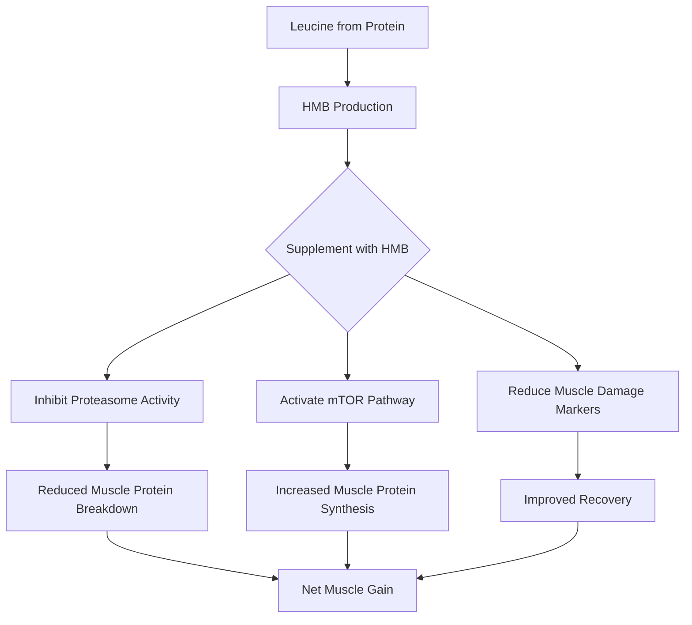
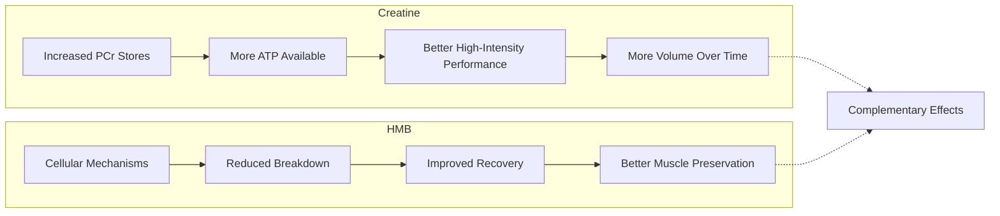

If you've been around bodybuilding and strength circles long enough, you've heard of HMB. It's been marketed as a muscle-preserving powerhouse—a compound that can help you hold onto your gains during fat loss phases and potentially accelerate muscle building. But after decades of research and countless supplement bottles sold, the question remains: does HMB actually deliver?

The answer, like most things in sports nutrition, is nuanced. HMB isn't a magic pill, but it's not worthless either. Let's break down what the science actually says and whether it deserves a place in your supplement stack.

## What is HMB and How Does It Work?

HMB stands for Beta-Hydroxy Beta-Methylbutyrate, which is a metabolite of the amino acid leucine. When you eat protein—particularly sources rich in leucine like whey, beef, or eggs—your body breaks some of that leucine down into HMB as a byproduct.

The rationale for supplementing HMB is straightforward: if HMB is a naturally occurring metabolite that helps regulate muscle protein synthesis and breakdown, then taking more of it should theoretically amplify those effects.

There are two main forms of HMB you'll encounter:

- **HMB-Ca (calcium salt):** The original and most common form, about 70-85% HMB by weight
- **HMB-FA (free acid):** A newer form with better absorption, though research is still limited on whether this translates to better results

The proposed mechanisms are where things get interesting. HMB appears to work through multiple pathways:

1. **Inhibiting muscle protein breakdown:** HMB may reduce the activity of the ubiquitin-proteasome system, which is your body's primary mechanism for breaking down muscle proteins. This is potentially huge during caloric deficits when muscle loss becomes a real concern.

2. **Stimulating protein synthesis:** Some research suggests HMB activates mTOR pathways, though this effect appears weaker than what you'd get from leucine itself or from actual protein intake.

3. **Reducing muscle damage:** Perhaps the most consistent finding in HMB research is its potential to reduce markers of muscle damage, which could theoretically speed recovery between training sessions.

The science here isn't as clean as supplement marketing would have you believe. These mechanisms are well-documented in cell and animal studies, but translating that to meaningful results in humans has been more challenging.

## The Evidence: Does HMB Build Muscle?

Here's where we separate hype from reality. Let's look at what meta-analyses—the gold standard for synthesizing research—actually tell us.

The most comprehensive analyses consistently show that HMB produces small but statistically significant effects on muscle strength and lean body mass. We're talking about gains in the range of 0.5-1.5 kg more than placebo over several weeks of training. That's not nothing, but it's also not game-changing.

**The trained vs. untrained question** is crucial. Most research suggests that beginners see more benefit from HMB than experienced lifters. This makes intuitive sense—if your body is already adapted to heavy training, there's less "room to improve" that HMB can unlock. One meta-analysis found that HMB effects were nearly doubled in untrained subjects compared to trained ones.

**Dosage research** points to around 3 grams per day as optimal. Studies using less than this often show minimal effects, while doses above 3g don't appear to provide additional benefits. The standard recommendation is straightforward: take 3g daily, typically divided into 1g doses.

**Timeline matters more than you might expect.** Unlike creatine, where saturation takes weeks, some studies show HMB effects can appear within 2-4 weeks. However, the research also suggests that effects may diminish over time as your body adapts—this has led some researchers to recommend cycling HMB, though evidence for cycling protocols is weak.

The ISSN (International Society of Sports Nutrition) position stand on nutrient timing acknowledged HMB's potential but noted that its effects are "minimal" compared to adequate protein intake. That should tell you something about where HMB ranks in the hierarchy of supplements.

## HMB vs. Creatine: Which Is Better?

This is a common question, and the answer might surprise you: these supplements work through completely different mechanisms, so they're not really competing.

**Creatine** primarily works by increasing phosphocreatine stores, which directly improves your ability to produce power during high-intensity, short-duration efforts. More ATP available means better performance on sets of 1-10 reps and faster recovery between sets.

**HMB**, on the other hand, works at the cellular level to potentially reduce muscle breakdown and slightly enhance synthesis. It's not directly improving your performance in the gym—it's more of a "protect and support" compound.

Here's the practical takeaway: if you're choosing between them, creatine has far more robust evidence for performance enhancement. But if your budget allows and you're already covering the basics (protein, creatine), HMB might add a small additional benefit—especially if you're in a caloric deficit or training hard enough that recovery is a bottleneck.

The two aren't redundant. Creatine helps you train harder; HMB helps you recover better and preserve muscle. They could theoretically complement each other, though research on stacking is limited.

## Who Should Consider HMB?

Based on the evidence, certain groups are more likely to benefit from HMB supplementation:

**Beginners to resistance training** are the classic case. If you're within your first 6-12 months of serious lifting, your body responds more dramatically to everything—including HMB. The research consistently shows larger effects in untrained subjects.

**Vegetarians and vegans** might have a particular case for HMB. Plant-based diets tend to be lower in leucine, and if you're not eating animal proteins regularly, your baseline HMB production might be lower. That said, simply eating more protein or leucine-rich foods would address this more directly.

**Older adults** dealing with anabolic resistance represent another group where HMB shows promise. Age-related declines in muscle protein synthesis mean that anything that can amplify the response to protein intake becomes more valuable. The research here is promising but not yet conclusive.

**During caloric restriction** is perhaps the most compelling use case. When you're in a deficit, protecting muscle becomes paramount, and HMB's anti-catabolic effects might help. Several studies show that HMB can reduce lean mass loss during weight loss phases, though the effect size is modest.

For the advanced lifter in a surplus, eating adequate protein, with well-optimized training, HMB is probably the lowest priority supplement on your list. The evidence just doesn't support meaningful benefits for this population.

## Practical Guidelines

If you decide to try HMB, here's what the evidence suggests:

**Dosage:** 3 grams per day is the research-backed amount. You can take it all at once or split it up—there's no strong evidence that timing matters significantly.

**Form:** HMB-Ca is the standard and most studied form. HMB-FA might have better absorption, but whether that translates to better results isn't established. Don't overpay for fancy formulations.

**Timing:** Take it with meals. This might improve absorption and reduce any potential gastrointestinal issues.

**Cycling:** There's no strong evidence that cycling is necessary, but some protocols suggest taking 4-8 weeks off periodically. This is more of a "might help, unlikely to hurt" approach.

**Expected timeline:** If HMB is going to work for you, you should notice something within 2-4 weeks. After 8-12 weeks, any effect likely plateaued.

**Cost consideration:** HMB isn't cheap compared to basics like creatine. Evaluate whether the modest potential benefit justifies the expense, especially if you're already covering the essentials.

## Potential Downsides and Considerations

HMB is generally well-tolerated. The side effect profile is mild, with some users reporting gastrointestinal discomfort at higher doses. There's no evidence of serious adverse effects in healthy populations.

The bigger consideration is cost versus benefit. At $20-40 per month, HMB is a significant investment for what appears to be a modest return. If you're on a tight budget, that money might be better spent on more proven interventions: more protein, better food quality, creatine, sleep optimization.

Quality control in the supplement industry is always a concern. Choose brands that third-party test their products—Informed Sport or NSF Certified for Sport are good benchmarks.

One more thing: HMB is not a replacement for protein. No matter how much HMB you take, if your protein intake is inadequate, you're not going to see results. Think of HMB as a potential supplement to a solid nutritional foundation—not a substitute for one.

## Bottom Line: Should You Take HMB?

For strength athletes specifically, the answer is: it depends.

If you're a beginner or intermediate lifter, especially during a fat loss phase or if you're not recovering optimally, HMB might provide a small but meaningful benefit. It's not going to transform your physique, but it could be the difference between gaining 5 kg of muscle versus 6 kg over a year.

If you're an advanced lifter with everything else optimized—protein intake, sleep, training, recovery—HMB is probably not worth your money. The evidence for meaningful effects in trained populations is weak.

The hierarchy is clear: get your protein intake right (at least 1.6-2.2g/kg bodyweight), consider creatine, optimize sleep and training, and only then think about HMB. If you've nailed all those basics and want to eke out every possible advantage, HMB is a reasonable addition. Otherwise, save your cash.

HMB is a "nice to have" supplement, not a "must have." The hype has always exceeded the evidence, but the science does support at least modest benefits for certain populations. Just keep your expectations realistic, and you'll never be disappointed.

---

*Track your HMB supplementation with Jacked. Download now.*
