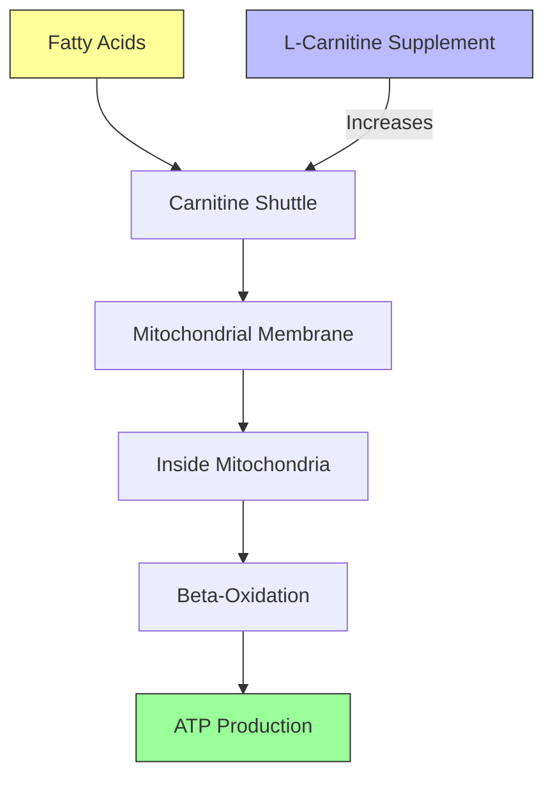

L-Carnitine is a naturally occurring compound often mistakenly classified as an amino acid. Chemically, it's beta-hydroxy-gamma-trimethylammonium butyrate—a quaternary ammonium compound synthesized in the body from the amino acids lysine and methionine. While it's not one of the 20 standard amino acids that build protein, L-carnitine plays a critical role in energy metabolism.

The primary function of L-carnitine is transporting fatty acids into the mitochondria, the cellular powerhouses where fat is burned for ATP production. Without adequate L-carnitine, your body cannot efficiently convert stored fat into usable energy. This transportation role makes L-carnitine theoretically appealing for anyone engaged in physical activity, particularly activities that rely on fat oxidation for sustained effort.

Your body produces L-carnitine endogenously in the liver and kidneys, with the heart and skeletal muscles containing the highest concentrations. However, dietary sources also contribute significantly to your L-carnitine status. Red meat is particularly rich—beef provides approximately 50-150mg of L-carnitine per 100 grams. Vegetarians and vegans typically have lower baseline L-carnitine levels due to the absence of animal products in their diet.

Several forms of L-carnitine exist, each with slightly different properties:

- **L-Carnitine (free carnitine):** The most common form, found naturally in the body and most supplements
- **Acetyl-L-carnitine (ALCAR):** Carnitine attached to an acetyl group, may cross the blood-brain barrier more readily
- **Propionyl-L-carnitine:** Bound to propionic acid, often studied for cardiovascular applications
- **L-Carnitine L-tartrate:** A salt form sometimes used in sports supplements

For strength athletes, the standard L-carnitine and acetyl-L-carnitine forms are most relevant, though the research landscape is complicated by studies using various forms at different doses.

## The Research on Strength and Power Output

Here's where things get interesting—and somewhat nuanced. The research on L-carnitine and athletic performance doesn't tell a simple story.

Several meta-analyses have examined L-carnitine's effects on physical performance. A 2019 systematic review and meta-analysis published in the Journal of the International Society of Sports Nutrition concluded that L-carnitine supplementation may improve exercise performance, particularly in tasks requiring sustained effort. However, the researchers noted significant heterogeneity across studies and called for more rigorous trials.

More specific to power output, some studies have shown promising results. Research published in the European Journal of Applied Physiology found that L-carnitine supplementation (2g daily for three weeks) improved peak power output and mean power output in trained cyclists. Similar findings have been reported in sprint and high-intensity interval training protocols.

However, here's the critical caveat: most of these studies involve endurance athletes—cyclists, runners, and sprinters. The data on resistance training specifically is considerably thinner. While the mechanisms (enhanced fatty acid oxidation, improved mitochondrial function) theoretically apply to weight training, the direct evidence in lifters remains limited.

The dose-response relationship appears to fall in the 2-4.5g daily range for performance benefits. Most positive studies use at least 2 grams per day, with some using more. There's little evidence that extremely high doses provide additional benefit, and the body's ability to saturate tissues appears to plateau somewhere in the 2-3g range for most individuals.

It's also worth noting that some studies show no significant effect. A study in the Journal of Strength and Conditioning Research found no meaningful improvement in resistance exercise performance with L-carnitine supplementation in trained men. This doesn't necessarily mean L-carnitine doesn't work—it may reflect the different energy systems used in resistance training versus the cycling and running protocols that show more consistent benefits.

## Recovery and Muscle Damage

Beyond direct performance effects, L-carnitine may offer recovery benefits that indirectly support strength training progress.

One of the most consistent findings in the research is L-carnitine's effect on blood lactate accumulation. Several studies show that supplementation reduces post-exercise blood lactate levels, particularly after high-intensity efforts. This could translate to faster recovery between sets during training, though direct evidence in resistance training is limited.

Research published in Amino Acids examined L-carnitine's effects on exercise-induced muscle damage. The study found that L-carnitine supplementation reduced markers of muscle damage (creatine kinase) and improved subjective recovery ratings following eccentric exercise. The proposed mechanisms include reduced inflammatory response and improved mitochondrial energy production during the recovery phase.

Additional studies have suggested L-carnitine may:

- Reduce delayed onset muscle soreness (DOMS)
- Improve muscle tissue repair
- Support capillary density and blood flow to muscles
- Decrease exercise-induced oxidative stress

For strength athletes, these recovery benefits might be more practically relevant than marginal performance improvements. If you can recover faster between sessions, you can train more frequently or with higher intensity—factors that ultimately drive long-term progress more than small acute performance boosts.

## Practical Considerations for Lifters

If you're considering L-carnitine supplementation, here's what you need to know about practical implementation.

**Optimal Dosing:** Based on the research, 2-4g daily appears to be the effective range. Most studies showing benefits use 2g, though some go higher. Starting with 2g daily is reasonable, with potential increases if you don't notice effects after several weeks.

**Timing:** L-carnitine can be taken with or without food. Some evidence suggests taking it with carbohydrates may enhance absorption, but this isn't firmly established. Unlike pre-workout supplements, timing relative to training doesn't seem critical—the benefits appear to come from chronic supplementation building tissue levels rather than acute effects.

**Form Differences:** For general fitness purposes, standard L-carnitine (L-carnitine tartrate or base) appears to work well. Acetyl-L-carnitine (ALCAR) is sometimes preferred for cognitive effects, though the evidence for cognitive benefits in young, healthy individuals is mixed. Propionyl-L-carnitine has been studied more for cardiovascular applications. For most strength athletes, regular L-carnitine at 2-4g daily is the straightforward choice.

**Side Effects and Safety:** L-carnitine is generally well-tolerated. At common supplemental doses (2-4g daily), side effects are rare but can include mild gastrointestinal discomfort, nausea, or diarrhea. These can often be mitigated by dividing the dose throughout the day or taking with food. At very high doses (beyond 5g daily), some people report fishy body odor—this is due to trimethylamine metabolism and is harmless but unpleasant.

The safety profile is good for most people. However, those with thyroid conditions or seizure disorders should consult a healthcare provider, as L-carnitine can interact with certain medications and conditions. People with kidney disease may need to avoid high doses due to impaired excretion.

## Bottom Line - Is It Worth It?

Let's cut through the noise and give you a practical assessment.

**Who might benefit from L-carnitine:**

- **Endurance athletes** (runners, cyclists, rowers): The evidence is strongest here. If you're doing prolonged cardiovascular work, L-carnitine may legitimately improve performance and recovery.
- **Older lifters** (40+): Age-related decline in carnitine levels may make supplementation more beneficial. Some research suggests older adults experience greater relative benefits.
- **Vegetarians and vegans**: Your baseline L-carnitine is likely lower due to dietary restrictions. Supplementation may bring you to levels comparable to omnivores.
- **Those training very high volumes**: If you're doing multiple sessions per day or extremely high training loads, the recovery benefits might be meaningful.

**Who probably doesn't need it:**

- **Young, healthy lifters with adequate nutrition**: If you're eating a balanced diet with regular red meat consumption, you're likely getting sufficient L-carnitine.
- **Beginner to intermediate trainees**: Your returns from proven fundamentals (adequate protein, sufficient calories, proper programming, sufficient sleep) will far exceed any marginal benefit from L-carnitine.
- **Those on a tight budget**: L-carnitine isn't cheap compared to proven supplements. Prioritize creatine monohydrate (one of the most researched supplements with clear benefits), adequate protein, and proper sleep before considering L-carnitine.

**Comparison to proven supplements:**

Let's be realistic: L-carnitine isn't in the same tier as supplements with overwhelming evidence:

- **Creatine monohydrate**: Unquestionably effective for strength and power. Far more research, far clearer benefits. If you're not taking creatine, start there.
- **Caffeine**: Proven ergogenic aid for nearly every activity type. Cheap, effective, well-understood.
- **Protein**: Fundamental. Get your protein intake sorted before any supplements.

L-carnitine occupies a lower tier—potentially beneficial, but not essential. Think of it as a possible addition once you've nailed the basics, not a replacement for proven strategies.

**The Verdict:** L-carnitine isn't a magic bullet for strength athletes. The research support is moderate, not overwhelming, and it's more relevant for endurance activities than heavy resistance training. However, it's safe, potentially beneficial, and might help with recovery if you've already optimized everything else. If you're an advanced lifter looking for marginal gains, or if you're doing significant endurance work alongside your lifting, it's worth a trial. Everyone else should prioritize the fundamentals first.

---

*Track your L-carnitine supplementation with Jacked. Download now.*
