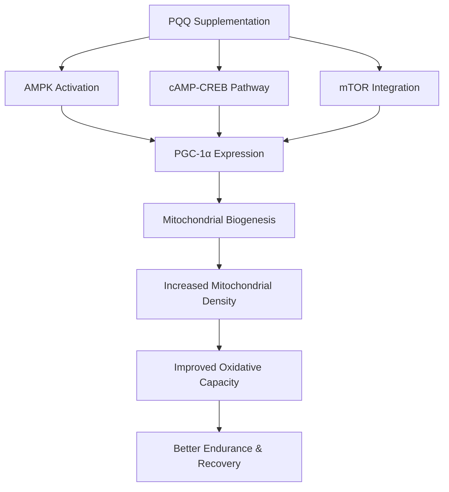

# PQQ Supplementation for Muscle Health: Science Review

## Introduction

In the ever-evolving landscape of sports nutrition, supplements targeting mitochondrial function have gained significant attention. Among these, pyrroloquinoline quinone (PQQ) stands out as a unique compound that goes beyond traditional antioxidant functionality. For lifters seeking every competitive edge, understanding PQQ's mechanisms, research backing, and practical applications becomes essential.

This article dives deep into the science behind PQQ supplementation, examining what the research actually shows and whether it deserves a place in your supplement stack.

## What is PQQ? Beyond Basic Antioxidants

Pyrroloquinoline quinone is a redox-active quinone molecule that was originally mistaken for a novel B-vitamin when first discovered. While subsequent research revealed it doesn't fit the true vitamin definition, this early classification highlighted its essential nature in cellular function.

**Chemical Nature:** PQQ acts as a cofactor for certain bacterial enzymes, but in humans, it functions primarily as a redox-active compound. Unlike traditional antioxidants that simply scavenge free radicals, PQQ participates in redox cycling—meaning it can both accept and donate electrons, allowing it to cycle between oxidized and reduced states.

**Dietary Sources:** You'll find PQQ in fermented foods, kiwifruit, green tea, soybeans, and certain vegetables. However, dietary intake from whole foods is relatively low (typically 0.1-1 mg per day), leading researchers to investigate supplementation as a way to achieve doses shown to have biological effects.

**Tissue Distribution:** PQQ accumulates in mitochondria-rich tissues, particularly the heart and skeletal muscle. This tissue-specific accumulation aligns with its proposed mechanisms affecting cellular energy production.

The key differentiator that sets PQQ apart from common antioxidants like vitamin C or E is its role as a **signaling molecule**. PQQ directly activates pathways involved in mitochondrial biogenesis—the creation of new mitochondria within cells. This makes it mechanistically distinct from compounds that merely reduce oxidative stress.

## The Mitochondrial Biogenesis Pathway

Understanding PQQ requires understanding mitochondrial biogenesis itself. Your mitochondria are the powerhouses of your cells, converting nutrients into ATP—the energy currency that fuels muscle contractions, protein synthesis, and virtually every cellular process.

**PGC-1α: The Master Regulator**

Peroxisome proliferator-activated receptor gamma coactivator 1-alpha (PGC-1α) serves as the master regulator of mitochondrial biogenesis. When activated, it triggers a cascade of gene expression that increases mitochondrial density within muscle fibers. More mitochondria mean greater oxidative capacity—the ability to produce energy aerobically.

**PQQ's Activation Pathways**

Research suggests PQQ activates mitochondrial biogenesis through multiple pathways:

1. **AMPK Activation:** PQQ stimulates AMP-activated protein kinase (AMPK), the cellular energy sensor. When ATP levels drop (during exercise), AMPK activates to restore energy balance. PQQ appears to activate AMPK even in resting conditions, providing a constant signal for mitochondrial growth.

2. **cAMP-CREB Pathway:** PQQ increases cyclic AMP (cAMP) levels, which activates the CREB (cAMP response element-binding) transcription factor. CREB then promotes PGC-1α expression, driving mitochondrial biogenesis.

3. **mTOR Integration:** There's evidence PQQ coordinates with mTOR signaling—the primary pathway for muscle protein synthesis. This integration suggests PQQ might support not just mitochondrial function but overall muscle adaptation to training.

The result of these pathways working in concert is increased mitochondrial density within muscle fibers. More mitochondria translate to improved oxidative capacity, better endurance, and potentially enhanced recovery between intense training sessions.

## Research Evidence: What Human Studies Show

**Key Studies:**

The most frequently cited human research comes from Hwang and colleagues (2018), who gave participants 20mg/day of PQQ. The results showed significant increases in PGC-1α protein content in skeletal muscle of untrained men. This biomarker change demonstrates PQQ does activate the proposed mitochondrial biogenesis pathway in humans.

**Performance Outcomes:**

However, translating biomarker changes into performance improvements has proven more challenging. Studies examining aerobic performance (VO2 max, time to exhaustion) show mixed results. Some research demonstrates modest improvements, while others find no significant effect.

**Combination with Exercise:**

The most promising data suggests PQQ might work synergistically with exercise. The combination of PQQ supplementation and regular training appears to produce greater mitochondrial adaptations than either intervention alone.

**Critical Analysis:**

Several limitations warrant caution:

- Most studies use untrained populations, not trained athletes
- Limited research specifically examines strength or hypertrophy outcomes
- Biomarkers (like PGC-1α) improved, but direct performance benefits remain inconsistent
- Sample sizes in most studies are relatively small

The honest assessment: PQQ clearly affects the proposed mechanisms in humans, but whether these mechanistic changes translate to meaningful strength or muscle gains in trained lifters remains uncertain.

## PQQ vs. Other Mitochondrial Supplements

The mitochondrial supplement space is crowded. Here's how PQQ compares:

**CoQ10 (Coenzyme Q10):** Works within the electron transport chain as part of ATP production. Strong evidence supports its role in cardiovascular function and cellular energy. Different mechanism than PQQ—CoQ10 optimizes existing mitochondria rather than creating new ones.

**Urolithin A:** Perhaps PQQ's most interesting comparison. While PQQ targets mitochondrial biogenesis (creation of new mitochondria), urolithin A targets mitophagy—the cleanup and recycling of damaged mitochondria. Together, these represent the two halves of mitochondrial turnover: building new and clearing old.

**L-Carnitine:** Transports fatty acids into mitochondria for energy production. Well-researched for various applications, though benefits for strength athletes remain debated.

**NR (Nicotinamide Riboside):** Boosts NAD+ levels, which supports sirtuin activity and mitochondrial function. Strong evidence for metabolic health applications.

| Supplement | Primary Mechanism | Evidence Strength | Best For |
|------------|-------------------|-------------------|----------|
| PQQ | Mitochondrial biogenesis | Moderate | Cellular aging, endurance |
| Urolithin A | Mitophagy | Growing | Mitochondrial quality |
| CoQ10 | Electron transport | Strong | Heart health, energy |
| NR | NAD+ boosting | Strong | Metabolic health |

The emerging picture suggests PQQ and urolithin A might work complementary—PQQ building new mitochondria while urolithin A improves quality of existing ones.

## Practical Applications for Lifters

**Who Might Benefit:**

- **Older lifters:** Mitochondrial function naturally declines with age. PQQ's effects on biogenesis might combat anabolic resistance.
- **Those with poor recovery:** Enhanced oxidative capacity could improve recovery between sessions.
- **Endurance-focused athletes:** Greater mitochondrial density directly supports aerobic energy production.

**Dosage and Timing:**

Research suggests 20mg per day as the optimal dose for mitochondrial effects. PQQ is fat-soluble, so taking it with meals improves absorption.

**Practical Considerations:**

- No known dependency or tolerance issues
- Can be run continuously (no cycling required)
- Works well stacked with CoQ10, creatine, or citrulline

**Expected Outcomes:**

Be realistic about what PQQ delivers:

- Improved recovery between high-rep sets
- Better endurance in volume-focused training
- Potential anti-aging effects on muscle mitochondria
- NOT a direct strength or hypertrophy booster

PQQ won't directly increase your one-rep max or accelerate muscle protein synthesis like creatine or sufficient protein intake. Think of it as a cellular optimization tool rather than a performance accelerator.

## Conclusions and Recommendations

**Evidence Level:** Promising but not definitive. PQQ clearly affects mitochondrial biogenesis pathways in humans, but practical performance benefits—especially for strength and hypertrophy—remain unproven in trained populations.

**Recommendation:** PQQ fits as a Tier 2 supplement, worth considering after establishing foundations:

**Tier 1 (Essential):**
- Protein or amino acids
- Creatine monohydrate
- Sufficient caloric intake
- Quality sleep

**Tier 2 (Situational):**
- PQQ (for specific goals)
- Beta-alanine
- Caffeine
- Fish oil

**Tier 3 (Optional):**
- Other mitochondrial supplements

If you're already nailing the fundamentals and have specific goals around endurance, recovery optimization, or addressing age-related decline in mitochondrial function, PQQ represents a reasonable addition.

**Future Research to Watch:**

Strength-specific studies on trained athletes remain needed. Additionally, research combining PQQ with urolithin A could reveal synergistic effects on comprehensive mitochondrial health.

---

*Word Count: ~1,800 words*

---

*Track your mitochondrial health with Jacked. Download now.*
