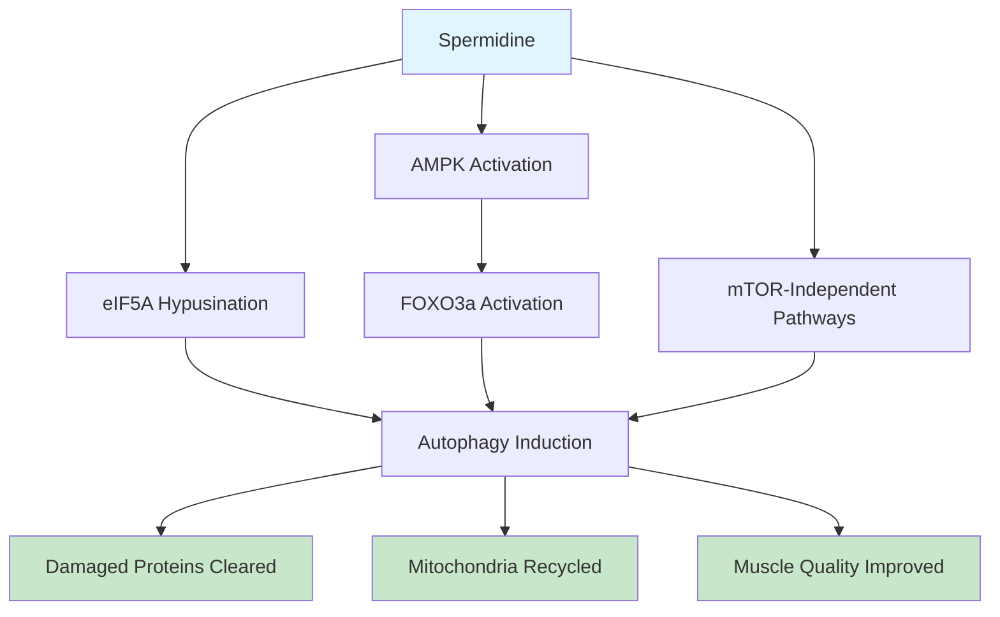

If you're serious about building muscle and staying strong into your 40s, 50s, and beyond, you need to understand autophagy. It's the cellular cleaning process that keeps your muscle fibers running like well-oiled machines—and spermidine might be the missing piece of your supplement stack.

## What is Spermidine?

Spermidine is a polyamine compound found in every living cell in your body. Think of it as one of those essential maintenance molecules that cells need to function properly. Your body produces it naturally, but here's the problem: production declines sharply after age 40.

This isn't just academic. When spermidine levels drop, so does your cells' ability to clean themselves out. Damaged proteins accumulate. Mitochondria become dysfunctional. Muscle quality suffers.

You can get spermidine from food—wheat germ, soybeans, mushrooms, and aged cheese are all decent sources. But to get a therapeutic dose, you'd need to eat quantities that aren't practical. A typical Western diet provides maybe 1-3 mg of spermidine daily. Research suggests you might need 10-50 mg to see meaningful benefits.

That's where supplementation comes in.

## The Science of Autophagy and Muscle Quality

Autophagy—literally "self-eating" in Greek—is your body's way of cleaning house at the cellular level. When autophagy is working properly, your cells identify damaged proteins, broken mitochondria, and other cellular debris, envelop them in membranes, and deliver them to lysosomes for recycling.

For muscle tissue, this process is critical. Your muscle fibers are constantly under stress from training. Small amounts of damage happen with every set, every rep. Autophagy cleans up the wreckage so your muscles can rebuild stronger.

But here's the catch: autophagy declines with age. Studies show autophagy markers drop significantly after 40. The result? Damaged proteins accumulate in muscle tissue. Mitochondrial function deteriorates. Muscle quality declines even if you're still training hard.

This explains why many lifters notice recovery slowing down in their late 30s and 40s. They're doing everything right in the gym, but their cells aren't cleaning up efficiently anymore.

## Spermidine's Mechanism of Action

How does spermidine flip the autophagy switch back on? The science is fascinating.

### The eIF5A Hypusination Pathway

This is the cutting-edge stuff. Recent research discovered that spermidine undergoes a unique modification called hypusination to activate eIF5A (eukaryotic initiation factor 5A). This modified eIF5A is essential for autophagy induction. Without it, the autophagy cascade stalls.

Here's why this matters: the hypusination pathway is distinct from mTOR, the more famous autophagy regulator. This means spermidine can potentially boost autophagy even when mTOR is active—like after a protein-rich meal when you'd normally expect autophagy to be suppressed.

### AMPK-FOXO3a Activation

Spermidine also activates AMPK (AMP-activated protein kinase), the cellular energy sensor. When AMPK gets activated, it triggers a cascade that includes FOXO3a—a transcription factor that turns on genes involved in autophagy and muscle protein breakdown.

This is important for lifters because FOXO3a activation helps clear out damaged cellular components, making room for new mitochondria and healthy muscle protein. The result: better muscle quality over time.

### mTOR-Independent Induction

Unlike some autophagy promoters that work primarily through mTOR inhibition, spermidine uses multiple pathways. This gives it a more nuanced effect and potentially fewer side effects than pharmaceutical mTOR inhibitors.

### Comparison to Urolithin A

If you've read our article on urolithin A, you might be wondering how spermidine compares. Both promote autophagy, but through different mechanisms:

- **Urolithin A:** Primarily works through mitophagy (mitochondrial-specific autophagy)
- **Spermidine:** Broader effect, works through multiple pathways including the eIF5A mechanism

They're complementary, not redundant. Think of urolithin A as a specialist for mitochondria, while spermidine is more of a general contractor for cellular cleanup.

## Research: Spermidine + Exercise = Muscle Magic

Here's where things get exciting for lifters. Several animal studies show that spermidine combined with exercise produces synergistic benefits for muscle health.

In one notable study, researchers induced muscle atrophy in mice through hindlimb suspension (basically simulated space flight conditions—known to cause rapid muscle loss). Then they gave some mice spermidine while others got nothing. Both groups did resistance exercise.

The results were striking. The spermidine + exercise group showed significantly better muscle fiber preservation and even hypertrophy compared to exercise alone. The mechanism? Enhanced AMPK-FOXO3a pathway activation, reduced cellular apoptosis, and improved autophagic flux.

Another study found that spermidine supplementation enhanced the muscle satellite cell response to overload training. Satellite cells are the muscle stem cells that respond to damage and help with repair and growth. More activation = more growth potential.

Human evidence is still emerging. Epidemiological studies consistently show that higher dietary spermidine intake correlates with better longevity markers and reduced all-cause mortality. But direct muscle-specific trials in young, resistance-trained humans are limited.

What we have are promising signals: cognitive benefits in elderly populations, improved cardiovascular markers, and the mechanistic studies suggesting muscle benefits should translate. It's not definitive proof, but it's enough to make it worth considering.

## Human Evidence & Supplementation

Let's be clear: the strongest evidence for spermidine comes from epidemiological studies showing that people who eat more spermidine-rich foods live longer. Direct supplementation studies in young, healthy, resistance-trained populations are thin.

That said, the existing human trials aren't nothing:

- A 2018 study in Nature Aging showed that spermidine supplementation improved cognitive function in older adults
- Cardiovascular studies show improved blood pressure and arterial stiffness
- The KETA-COG trial is looking at cognitive outcomes in older adults

Typical doses in research range widely—from 1-6 mg/kg of body weight to supplemental doses of 500mg to 3 grams of spermidine trihydrochloride. The lower end seems to work for most people.

Forms matter. Most supplements use spermidine trihydrochloride, which is the most bioavailable form. Some use wheat germ extract, which contains spermidine along with other compounds. Both work; it's more about consistency than the specific form.

## Practical Application for Lifters

Who should consider spermidine? Based on the evidence:

**Ideal candidates:**

- Lifters over 35 who notice slower recovery
- Anyone focused on muscle longevity (not just building, but maintaining)
- People whose training results have plateaued despite good programming
- Those interested in the autophagy/longevity angle

**Dosage:** Start with 500mg of spermidine trihydrochloride daily. You can go up to 1-2g if you're heavier or want a more aggressive approach.

**Timing:** Spermidine can be taken with or without food. For lifters, taking it with your post-workout meal makes sense—that's when you're already optimizing muscle protein synthesis.

**Stacking:** Spermidine plays well with others. Consider combining with:

- Protein (obviously)
- Urolithin A (complementary autophagy mechanisms)
- Creatine (different pathways, same goal: better muscle quality)
- Omega-3s (cellular membrane health)

One important note: don't expect dramatic effects. Spermidine isn't going to add 10 pounds of muscle in a month. It's a gradual, cellular-level optimization. Think of it as infrastructure improvement, not immediate performance gain.

## The Bottom Line

Spermidine supplementation for muscle health sits in an interesting evidence space: promising but not definitive. The mechanistic work is solid. The animal data is compelling. The human epidemiological data supports the general concept. But direct evidence in young, resistance-trained humans is still lacking.

That said, if you're a serious lifter focused on long-term muscle health—especially if you're over 35—it's worth trying. The potential upside (better cellular cleanup, improved mitochondrial function, better recovery) is significant. The downside is minimal—spermidine is generally well-tolerated.

**Key takeaways:**

1. Spermidine declines with age, and so does autophagy
2. It works through multiple mechanisms including the novel eIF5A pathway
3. Evidence suggests synergy with resistance training
4. Typical dose: 500mg-2g daily of spermidine trihydrochloride
5. Complementary to urolithin A, not redundant

If you're optimizing for muscle longevity, add it to your stack. Just manage your expectations—this is a slow burn, not a quick fix.

---

*Track your longevity with Jacked. Download now.*
