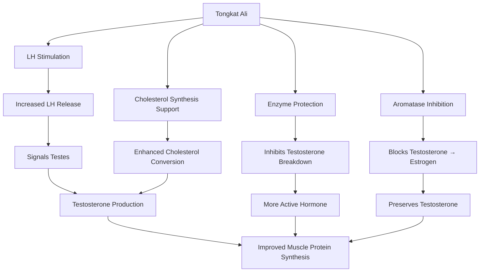

Tongkat Ali, scientifically known as *Eurycoma longifolia* Jack, is a flowering plant native to Southeast Asia—particularly Malaysia, Indonesia, and Thailand. Often dubbed "Malaysian ginseng" or "Ali's walking stick," this herb has been used for centuries in traditional medicine to treat male sexual dysfunction, combat fatigue, and restore vitality in aging men. But in recent years, it's caught the attention of the fitness community as a potential natural testosterone booster. If you're a lifter looking for a science-backed supplement to support your hormones and training performance, Tongkat Ali deserves a closer look.

## What is Tongkat Ali?

Tongkat Ali grows wild in the rainforests of Southeast Asia, where local communities have used its roots for generations. Traditional applications included treating erectile dysfunction, improving energy levels, and supporting overall male health. The root contains several bioactive compounds, with eurypeptides, glycosaponins, and euryloph being the most studied. These compounds are believed to be responsible for the herb's pharmacological effects, particularly its influence on hormonal pathways.

Modern supplements typically use standardized extracts rather than raw root powder. The most researched form is a proprietary extract called **Physta®**, which has been used in multiple clinical trials. This standardization matters—different products can vary dramatically in potency depending on how they're processed and what percentage of active compounds they contain.

## Testosterone Enhancement Mechanism

Here's where things get interesting for lifters. Tongkat Ali appears to influence testosterone levels through multiple pathways:

**Stimulation of Luteinizing Hormone (LH):** LH is the pituitary hormone that signals the testes to produce testosterone. Tongkat Ali may increase LH release, directly boosting testosterone synthesis.

**Aromatase Inhibition:** Aromatase is the enzyme that converts testosterone into estrogen. By inhibiting this enzyme, Tongkat Ali helps preserve testosterone levels rather than letting them get "lost" to estrogen conversion.

**Protection from Degradation:** Some research suggests eurypeptides may inhibit the action of enzymes that break down testosterone, keeping more active hormone circulating in the bloodstream.

**Support for Cholesterol-Based Synthesis:** Testosterone is synthesized from cholesterol. Tongkat Ali may support the enzymatic pathways involved in this conversion, providing more raw material for testosterone production.

The synergy of these mechanisms makes Tongkat Ali uniquely positioned among natural testosterone boosters—it's not just doing one thing, it's supporting multiple steps in the testosterone production cascade.

## Clinical Evidence — Testosterone Levels

What does the actual research say? A 2022 meta-analysis examining Tongkat Ali's effects on testosterone found significant increases in serum total testosterone levels compared to placebo. This isn't just a small bump—several studies show meaningful elevations, particularly in men with low baseline testosterone.

One notable 6-month randomized controlled trial followed men with ADAM (Androgen Deficiency in the Aging Male) scores. The participants who took Tongkat Ali while engaged in resistance training showed increased total testosterone levels, while the placebo group saw no significant change. The training component appeared synergistic—the herb may enhance the hormonal response to exercise.

A multi-center double-blind study published in *Food & Nutrition Research* found that participants taking EL (Physta®) extract showed significantly higher testosterone levels versus placebo after 12 weeks. The effect was most pronounced in men who started with lower baseline testosterone—a finding that aligns with the idea that Tongkat Ali works best when you actually need support.

This is an important nuance: if your testosterone is already optimal, you likely won't see dramatic effects. But if you're an older lifter experiencing age-related declines, or if you have clinically low T, the research suggests meaningful benefits.

## Strength and Performance Outcomes

Now for the question every lifter cares about: does this translate to better performance in the gym?

Research on strength outcomes is promising but more nuanced than the testosterone data. Studies in active seniors have shown improved muscle strength with Tongkat Ali supplementation. When combined with resistance training, some trials demonstrate enhanced strength gains compared to training alone.

The body composition data is mixed. Some studies show modest improvements in lean mass, while others don't reach statistical significance. This isn't surprising—Tongkat Ali isn't a direct anabolic like steroids. It works indirectly by supporting hormonal status, which then creates a more favorable environment for muscle growth and strength gains.

Think of it this way: Tongkat Ali doesn't build muscle by itself. Instead, it helps optimize your hormonal environment so that your training stimulus translates into better results. The effect is supportive rather than transformative.

## Optimal Dosing and Safety

Clinical studies typically use **200-400mg daily** of standardized extract. The Physta® extract, being the most researched, is the form you'll want to look for on labels. Some products list "root powder" or generic "Tongkat Ali extract"—these can vary significantly in potency.

On the safety front, Tongkat Ali appears well-tolerated. Most studies report minimal side effects, and long-term data up to 12 months shows favorable safety profiles. This is reassuring for lifters looking to use it consistently over extended periods.

However, quality matters enormously. The supplement industry isn't well-regulated, and products vary widely in actual active compound content. Look for extracts standardized for a specific percentage of eurypeptides or glycosaponins. Reputable brands often provide third-party testing information. If a deal seems too good to be true, it probably is—you're likely getting low-potency root powder with minimal active compounds.

## Practical Application for Lifters

So how should you actually use Tongkat Ali in your supplementation strategy?

**Best candidates:** Older lifters (35+), those experiencing low T symptoms (poor recovery, decreased energy, poor libido), or anyone with confirmed low baseline testosterone. Younger lifters with healthy hormone levels may see less dramatic effects.

**Timing:** Tongkat Ali can be taken any time of day—studies haven't shown significant timing advantages. Take it consistently rather than worrying about pre- or post-workout timing.

**Cycling:** Some protocols recommend 2-3 months on followed by a 1-month break. The rationale is to prevent receptor desensitization, though research on optimal cycling is limited. If you're noticing diminishing returns, a break might help.

**Stacking:** Tongkat Ali works synergistically with resistance training—that's been demonstrated in multiple studies. It also pairs well with other testosterone-supporting compounds like vitamin D, zinc, and ashwagandha. Just don't expect it to magically amplify other supplements' effects.

**Expectations:** Give it 2-4 weeks before noticing changes in energy, mood, or training performance. Hormonal adaptations take time. If you're not seeing anything after 6-8 weeks, either your baseline T is already adequate, or you might need a higher-quality product.

## Limitations and Realistic Expectations

Let's be real: Tongkat Ali isn't a magic pill. You still need to train hard, eat enough protein, and sleep adequately. The supplement supports your efforts—it doesn't replace the fundamentals.

The research is clear: Tongkat Ali works best in men with lower baseline testosterone. If you're a young, healthy lifter with optimal hormone levels, you might experience subtle benefits (better energy, improved mood) without dramatic changes in strength or muscle mass.

Individual response varies significantly. Genetics, baseline hormone status, product quality, and training age all influence outcomes. What works wonders for one person might do little for another.

Quality and standardization remain the biggest practical challenges. The difference between a high-quality standardized extract and cheap root powder is enormous. Do your research, read reviews, and ideally choose products used in clinical studies.

## The Bottom Line

Tongkat Ali offers legitimate science-backed support for testosterone levels, particularly in men with low T or age-related declines. The mechanisms are well-documented, clinical evidence supports efficacy, and safety data looks favorable for long-term use.

For older lifters looking to optimize their hormonal environment, or anyone dealing with low testosterone symptoms, Tongkat Ali deserves a place in your supplement stack. Just manage your expectations—it supports your hormones and training, it doesn't replace either. Combined with consistent resistance training, adequate sleep, and proper nutrition, it can help you extract more from your efforts in the gym.

**Key takeaways:**

- Tongkat Ali has solid clinical support for increasing testosterone in men with low baseline levels
- Works through multiple mechanisms: LH stimulation, aromatase inhibition, and protection from degradation
- Best results in older lifters or those with low T symptoms
- Choose standardized extracts (200-400mg daily) from reputable brands
- Combined with resistance training for optimal results
- Realistic expectations: supports hormones, doesn't replace hard work

If you're over 30 and haven't had your testosterone checked, consider getting baseline bloodwork. Knowing your numbers helps you determine whether Tongkat Ali (or any testosterone-supporting supplement) makes sense for your situation.

---

*Track your hormones with Jacked. Download now.*
