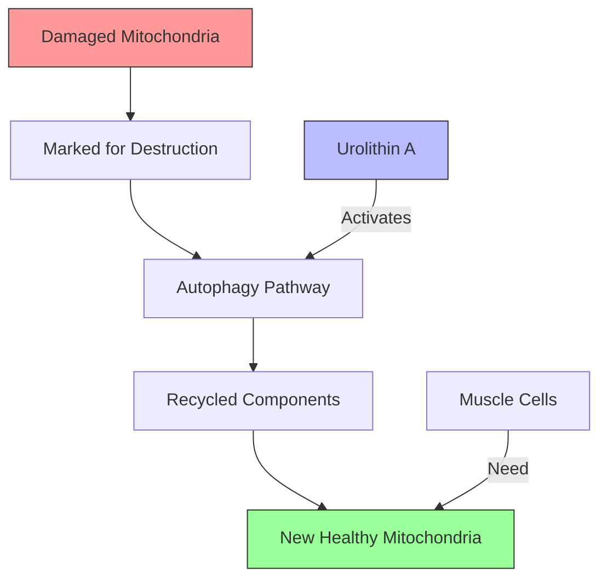

If you've been paying attention to the supplement industry lately, you've probably heard about urolithin A. It's being billed as something close to a miracle compound—a natural substance that can rejuvenate your mitochondria, fight aging, and potentially extend your physical prime. But what's the actual science behind the hype? And more importantly, should you actually spend your money on it?

Let's break down what urolithin A is, how it works, and whether it deserves a place in your supplement stack.

## What is Urolithin A?

Urolithin A is a fascinating compound that sits somewhere between a supplement and a postbiotic. It's naturally found in foods like pomegranates, berries, and certain nuts—but here's the catch: you can't actually get therapeutic amounts from food alone.

That's because urolithin A isn't directly present in these foods. Instead, it's produced when your gut bacteria metabolize compounds called ellagitannins, which are abundant in pomegranates and some berries. The process is complex, and here's the kicker: only about 10% of the Western population actually produces significant amounts of urolithin A endogenously.

This means that for roughly 90% of people, urolithin A supplementation is literally the only way to get meaningful amounts of this compound. If you've ever eaten a pomegranate and wondered why you didn't feel any different, now you know why.

## The Science of Mitophagy

To understand why urolithin A has generated so much excitement, you need to understand mitophagy. Don't worry—we'll keep it simple.

Your muscle cells are packed with mitochondria—the powerhouses that generate ATP, the energy currency your body uses for everything from heavy squats to walking to the fridge. But here's the problem: mitochondria aren't immortal. Over time, they become damaged, dysfunctional, and less efficient at producing energy.

This is especially true as you age. Older mitochondria accumulate, creating a backlog of cellular "dead weight" that not only produces less energy but also generates more oxidative stress and inflammation. It's one of the reasons we experience age-related declines in strength, endurance, and recovery.

Mitophagy is your body's way of cleaning house. It's a specific type of autophagy—the cellular recycling process that breaks down damaged components and repurposes their building blocks. When mitophagy works properly, your cells identify old or damaged mitochondria and mark them for destruction. The cell then recycles the raw materials to build fresh, healthy mitochondria.

This is where urolithin A comes in. Research has shown that urolithin A can activate the mitophagy pathway, essentially giving your cellular cleanup crew a much-needed boost. The science is compelling: in animal studies, urolithin A has been shown to improve mitochondrial function, increase muscle strength, and extend lifespan.

But here's what makes this particularly relevant for muscle health: muscle cells have some of the highest energy demands in your body. They need tons of functional mitochondria to perform at their best. When mitophagy is impaired, your muscles don't just feel tired—they actually become less capable of producing force, recovering efficiently, and adapting to training stress.

## Research on Muscle Strength and Performance

Now for the million-dollar question: does urolithin A actually improve muscle strength and performance in humans?

The most frequently cited study is a 2019 trial published in Nature Medicine. Researchers gave 90 older adults (ages 40 to 80) either urolithin A or a placebo for four months. The results were encouraging: participants taking urolithin A showed improved muscle strength and reduced biomarkers of inflammation compared to the placebo group.

But before you rush to buy stock in urolithin A, let's look at what the study actually measured. The primary outcomes were grip strength and something called the "6-minute walk test"—a measure of functional capacity, not necessarily maximal strength or athletic performance. The improvements were statistically significant but modest, and the study population was older adults, not young athletes.

Follow-up studies have looked at mitochondrial function directly, showing that urolithin A can improve markers of mitochondrial health. However, the evidence for dramatic performance enhancements in healthy, young, training individuals is essentially nonexistent.

This is a crucial distinction. The research suggests urolithin A might help restore mitochondrial function in people who have already experienced age-related decline. It might help older adults maintain muscle mass and strength. But there's no evidence it will take an already-healthy 25-year-old athlete and make them significantly stronger or faster.

The science is promising, but it's not a magic pill for performance. It's a compound that addresses a specific biological mechanism—mitochondrial quality control—that becomes more relevant with age.

## Who Might Benefit

Given the current evidence, urolithin A supplementation makes the most sense for specific populations:

**Older adults (40+) experiencing declining mitochondrial function.** This is where the evidence is strongest. If you're noticing that recovery takes longer, strength gains have stalled, and you just don't feel as energetic as you used to, urolithin A might help address the underlying mitochondrial component of that decline.

**People with poor gut health who can't produce urolithin A endogenously.** Remember that only about 10% of people produce significant amounts naturally. If you have gut issues, have taken lots of antibiotics, or have digestive problems that might affect your microbiome, you might be in the 90% who can't make their own.

**Those looking for anti-aging and longevity benefits.** The mitophagy mechanism is genuinely exciting from a longevity perspective. While the performance benefits for young athletes are unproven, the cellular health implications are theoretically compelling.

**What about young, healthy athletes?** Here's where I'd be cautious. If you're 25, training regularly, sleeping enough, and eating well, your mitochondria are probably functioning just fine. The evidence doesn't support urolithin A as a performance enhancer for this population. Your money is likely better spent on proven supplements like creatine, protein, or beta-alanine.

## Practical Considerations

If you've decided urolithin A might be worth trying, here's what you need to know:

**Dosage:** The standard dose used in research is 500mg to 1000mg daily. Most supplements on the market offer 500mg or 500mg capsules, so one to two capsules per day is typical.

**Timing:** There's no specific optimal time, but taking it with a meal might improve absorption. More importantly, consistency matters. Urolithin A works by supporting an ongoing biological process—you're not going to feel different after one dose. Give it at least 4-6 weeks before evaluating effects.

**Cost:** Let's be honest: urolithin A supplements aren't cheap. Monthly supplies typically run $30-60+, depending on the brand and dosage. This is significantly more expensive than basic supplements like creatine or protein powder. You need to decide if the potential benefits justify the cost for your specific situation.

**Quality and sourcing:** Not all urolithin A supplements are created equal. Look for products that specify urolithin A specifically—not just "pomegranate extract" or "ellagitannins." The conversion from food sources to actual urolithin A is unreliable, so you want a supplement that delivers the actual compound in meaningful doses.

**The bottom line on consistency:** This isn't a supplement you take before a workout. It's a daily commitment to supporting cellular health over time. If you're looking for immediate performance effects, look elsewhere.

## The Bottom Line

Urolithin A is one of the more scientifically grounded newer supplements to hit the market. The mitophagy mechanism is real, the research in older adults is promising, and the compound appears safe at recommended doses.

However, it's not magic. It's not going to transform your physique or break your personal records. It's a targeted intervention for a specific biological process that becomes more relevant as you age.

**Should you take it?** If you're over 40, experiencing the effects of mitochondrial decline, and have the budget for it—probably yes. If you're a young athlete looking for a competitive edge—probably no. Your money is better spent on the fundamentals: adequate protein, sufficient sleep, proper training, and proven supplements like creatine.

**The cost-benefit analysis** matters here. Urolithin A costs significantly more than most supplements with far less proven benefit for performance. Until we see more research in younger, athletic populations, it makes most sense as part of a broader longevity-focused approach for older adults.

As always, talk to a healthcare provider before starting any new supplement regimen—especially if you have underlying health conditions or are taking medications.

The science on urolithin A will continue evolving. For now, manage your expectations, understand who it's really for, and don't expect miracles.

---

*Track your urolithin A with Jacked. Download now.*
