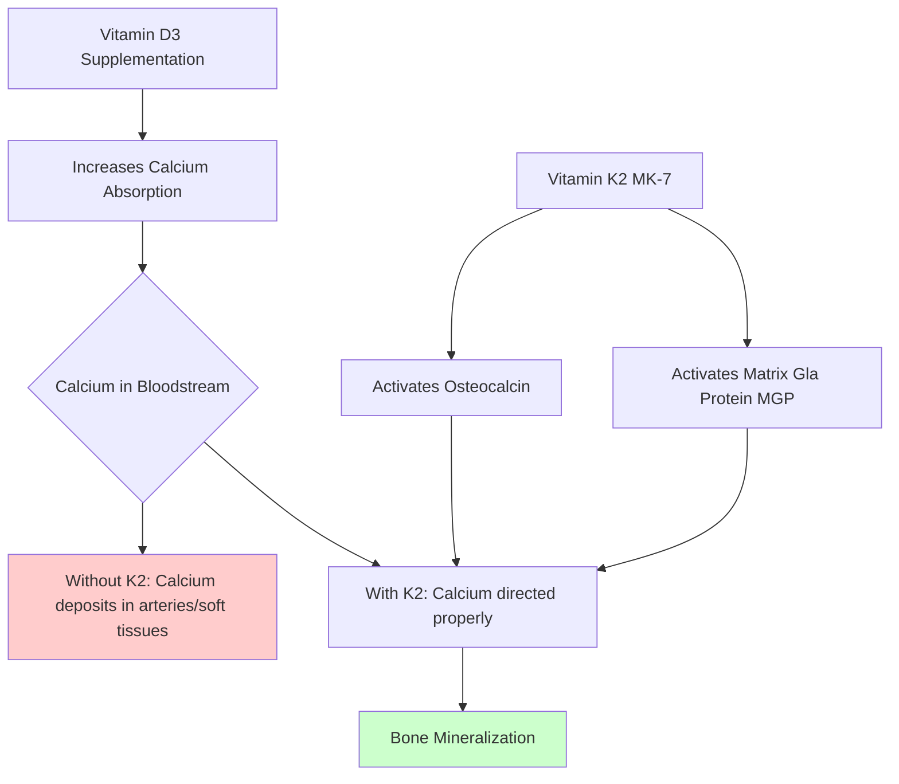

If you're serious about lifting, you've got your supplementation basics locked down. Protein is dialed in. Creatine is working. You might even be running a proper vitamin D3 protocol. But there's one nutrient that flies under the radar for most lifters — vitamin K2 — and it's quietly doing critical work in your bones, joints, and potentially even your recovery.

Here's the thing: heavy resistance training places enormous mechanical stress on your skeleton. Your bones aren't just passive scaffolding — they're living tissue that remodels in response to load. And K2 is the nutrient that tells your body where to put the calcium. Without it, you're essentially building a house with no blueprint. The materials are there, but they're going to the wrong places.

This article breaks down exactly why K2 matters for strength athletes, the science behind it, and how to optimize your intake without overcomplicating things.

## What Actually Is Vitamin K2?

Most people know vitamin K for its role in blood clotting. But K2 is a different animal entirely — and it operates almost entirely outside the bloodstream.

The vitamin K family breaks down into two main players:

- **Vitamin K1 (phylloquinone):** Found in leafy greens. Your body uses it primarily for blood clotting.
- **Vitamin K2 (menaquinone):** Found in fermented foods. This is where the action is for athletes.

Within K2, you mainly see two forms that matter for supplementation:

- **MK-4 (menaquinone-4):** Short-acting, found in animal products like egg yolks and butter. Gets cleared quickly.
- **MK-7 (menaquinone-7):** Long-acting, derived from natto (fermented soybeans). Stays in your system for days.

The mechanism is elegant: K2 activates two key proteins — osteocalcin and matrix Gla protein (MGP). Osteocalcin pulls calcium into your bones. MGP keeps calcium out of your arteries and soft tissues. Think of K2 as the traffic controller for calcium in your body. Without it, calcium ends up in the wrong places.

## Why Strength Athletes Need K2 More Than Anyone

Your bones adapt to the loads you place on them. That's the fundamental principle behind progressive overload and skeletal hypertrophy. But this remodeling process requires the right building blocks — and K2 is non-negotiable.

### Bone Density and Structural Integrity

Research consistently shows that K2 supports bone mineral density. A meta-analysis in the journal *Osteoporosis International* found that K2 supplementation significantly reduced bone loss at the lumbar spine and femoral neck — areas that matter for overall structural integrity under load.

For strength athletes, this isn't about preventing osteoporosis in your 70s. It's about:

- **Long-term joint health:** Your joints depend on healthy bone underneath. Degenerative changes in subchondral bone contribute to osteoarthritis.
- **Injury prevention:** Stronger bones resist stress fractures — a real risk for high-volume lifters, especially during bulking phases when you're hammering your skeleton with heavy compounds.
- **Force transmission:** Your muscles pull on your bones through tendons. The stronger and healthier the bone-tendon interface, the more efficient force transfer becomes.

### The Muscle Recovery Angle

Here's where it gets interesting for athletes. Matrix Gla protein (MGP) doesn't just exist in your vascular system — it's also present in soft tissues, including muscle. Some researchers believe K2's role in tissue calcification regulation may influence muscle damage and recovery.

The TAKEOVER study (a 2022 randomized controlled trial) examined K2 supplementation's effects on exercise recovery in healthy adults. The K2 group showed improvements in subjective recovery ratings and reduced signs of muscle damage compared to placebo. While more research is needed, the mechanistic plausibility is there: regulating soft tissue calcification could mean less post-exercise stiffness and better adaptation.

Is K2 a magic recovery supplement? No. But it's a piece of the puzzle that most lifters are completely missing.

## The Vitamin D3 Synergy You Can't Ignore

If you're already supplementing vitamin D3 — and you should be, especially if you're in the northern hemisphere — you need K2. Here's why.

Vitamin D3 increases calcium absorption from your gut. That's good. But if that calcium doesn't have anywhere to go, it starts depositing in your arteries and soft tissues. That's bad. K2 solves this problem by activating MGP, which pulls calcium out of your blood vessels and into your bones where it belongs.

This is why you'll see D3 + K2 as a standard pairing in the literature. They work synergistically:

- D3 → increases calcium absorption
- K2 → directs that calcium to the right places

The practical implication: if you're running a vitamin D protocol (and you should be getting your levels tested), pair it with K2. Otherwise you're essentially dumping calcium into places you don't want it.

## Dosage, Forms, and Practical supplementation

### Which Form?

For supplementation purposes, **MK-7 is the winner**. It has a longer half-life (several days versus hours for MK-4), meaning you get more consistent coverage with once-daily dosing. MK-7 typically comes from natto or is produced via bacterial fermentation.

### Typical Doses

- **MK-7:** 100–200 mcg daily
- **MK-4:** 1–5 mg daily (but requires more frequent dosing)

Most clinical research showing benefits uses 100–200 mcg of MK-7. This dose is well-established as safe. There's no known toxicity level — K2 is fat-soluble, but studies using up to 90 mg daily (yes, milligrams) have shown no adverse effects.

### Timing

Take K2 with a meal containing fat. Like all fat-soluble vitamins, K2 requires dietary fat for optimal absorption. If you're taking it with your vitamin D3 (which is also fat-soluble), you're already sorted.

### Food Sources

If you're eating traditional diets, you might get enough K2 naturally:

- **Natto:** The king of K2. A small serving can contain 500+ mcg of MK-7.
- **Cheese:** Particularly hard cheeses like Gouda and Edam.
- **Egg yolks:** Minor amounts, but they add up if you're eating several eggs daily.
- **Butter and meat:** Contain MK-4 in smaller amounts.

The problem: most Western diets are woefully short on fermented foods. Unless you're eating natto regularly, you're probably under-consuming K2. This is why supplementation makes sense for most lifters.

## Who Should Actually Supplement?

Not everyone needs to add K2 to their stack. But these groups should definitely consider it:

1. **High-volume lifters** — If you're training heavily (5+ days per week, heavy compounds), your bones are under constant adaptive stress. Give them the tools to respond.

2. **Older athletes** — Bone density naturally declines with age. If you're 35+, this becomes increasingly relevant.

3. **Anyone not eating fermented foods** — If natto isn't part of your rotation, you're likely deficient.

4. **People running vitamin D3** — As discussed, pairing D3 with K2 is practically mandatory.

5. **Those with joint concerns** — If you're dealing with joint stiffness or early-stage degenerative issues, K2's role in soft tissue health may help.

## Your Practical Plan

This doesn't need to be complicated:

1. **Get your vitamin D levels tested.** Aim for 50–80 ng/mL. Supplement with D3 to reach this range.
2. **Add K2 (MK-7) at 100–200 mcg daily.** Take it with your D3 and a fatty meal.
3. **Consider food sources.** If you can stomach natto, it's the most potent natural source. But don't force it — supplementation is easier and more consistent.
4. **Re-test vitamin D annually.** Adjust your D3 dose based on blood work, not guesswork.

That's it. One capsule daily, paired with your vitamin D. Minimal effort, meaningful long-term benefit.

## The Bottom Line

Vitamin K2 isn't going to add 50 pounds to your bench press next month. It's not a flashy supplement. But it's working in the background — protecting your bones, supporting your joints, and potentially aiding your recovery between sessions.

For strength athletes, bone health isn't optional. It's the foundation everything else builds on. And K2 is the nutrient that ensures that foundation stays strong.

If you're already optimizing your protein, your creatine, your vitamin D — adding K2 is the logical next step. Your future self will thank you when you're still repping heavy at 40.

---

*Your bones are the foundation of every lift. Treat them accordingly.*

---

*Track your bone health with Jacked. Download now.*
