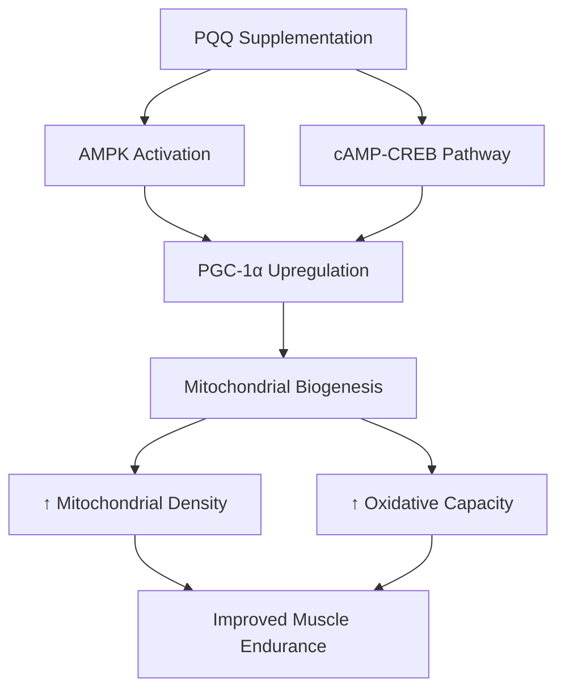

# PQQ Supplementation for Muscle Health: Science Review

## Overview
- **Topic:** Pyrroloquinoline quinone (PQQ) for mitochondrial biogenesis and muscle health in lifters
- **Focus:** Research-backed analysis of PQQ's mechanisms, benefits, and practical applications
- **Target Audience:** Science-aware lifters looking for evidence-based supplements

---

## 1. What is PQQ? Beyond Basic Antioxidants
- Chemical nature: Redox-active quinone molecule
- Discovery: Originally mistaken for a novel B-vitamin (not truly a vitamin)
- Unique mechanism: Unlike traditional antioxidants, PQQ participates in redox cycling
- Dietary sources: Found in fermented foods, kiwifruit, green tea, soybeans
- Body stores: Accumulates in mitochondria-rich tissues (heart, skeletal muscle)

### Key Differentiator
PQQ is not just an antioxidant—it acts as a **signaling molecule** that activates mitochondrial biogenesis pathways directly.

---

## 2. The Mitochondrial Biogenesis Pathway
- **PGC-1α:** Master regulator of mitochondrial biogenesis
- **cAMP-CREB pathway:** PQQ activates CREB phosphorylation
- **AMPK activation:** Energy sensing pathway stimulated by PQQ
- **mTOR relationship:** Integration with muscle protein synthesis pathways

### Mermaid Diagram: PQQ Mitochondrial Mechanisms

---

## 3. Research Evidence: What Human Studies Show
- **Hwang et al. (2018):** 20mg/day PQQ increased PGC-1α protein content in untrained men
- **Performance outcomes:** Mixed results on aerobic performance
- **Combination with exercise:** Possible synergistic effects
- **Dosage studies:** 20mg appears optimal for mitochondrial effects
- **Study limitations:** Most research on untrained subjects, limited strength-specific data

### Critical Analysis
- Most studies use untrained populations
- Limited research on trained athletes/lifters
- Biomarkers (PGC-1α) improved, but performance gains inconsistent
- More research needed on strength-specific outcomes

---

## 4. PQQ vs. Other Mitochondrial Supplements
- **CoQ10:** Different mechanism, works in electron transport chain
- **Urolithin A:** Also targets mitophagy (the other half of mitochondrial turnover)
- **L-Carnitine:** Shuttles fatty acids into mitochondria
- **NR (Nicotinamide Riboside):** Boosts NAD+ levels

### Practical Comparison Table

| Supplement | Primary Mechanism | Evidence Strength | Best For |
|------------|-------------------|-------------------|----------|
| PQQ | Mitochondrial biogenesis | Moderate | Cellular aging, endurance |
| Urolithin A | Mitophagy | Growing | Mitochondrial quality |
| CoQ10 | Electron transport | Strong | Heart health, energy |
| NR | NAD+ boosting | Strong | Metabolic health |

---

## 5. Practical Applications for Lifters
- **Who might benefit:**
  - Older lifters (anabolic resistance, mitochondrial decline)
  - Those with poor recovery between sessions
  - Athletes focusing on endurance within strength training

- **Dosage:** 20mg/day appears optimal (most studies)
- **Timing:** With meals (fat-soluble)
- **Cycle considerations:** No known dependence, can run continuously
- **Stack potential:** Works well with CoQ10, creatine, citrulline

### Expected Outcomes (Manage Expectations)
- Improved recovery between sets (enhanced oxidative capacity)
- Better endurance in high-rep training
- Potential anti-aging effects on muscle mitochondria
- NOT a direct strength booster

---

## 6. Conclusions and Recommendations
- **Evidence level:** Promising but not definitive
- **Recommendation:** Consider for specific goals (endurance, recovery, aging)
- **Priority:** Supplements like creatine, creatine, and protein come first
- **Future research:** Watch for strength-specific studies

### Bottom Line
PQQ is scientifically interesting with plausible mechanisms, but it's a **Tier 2 supplement** for most lifters. The mitochondrial biogenesis pathway it activates is genuine, but practical strength/hypertrophy benefits remain unproven in trained populations.
